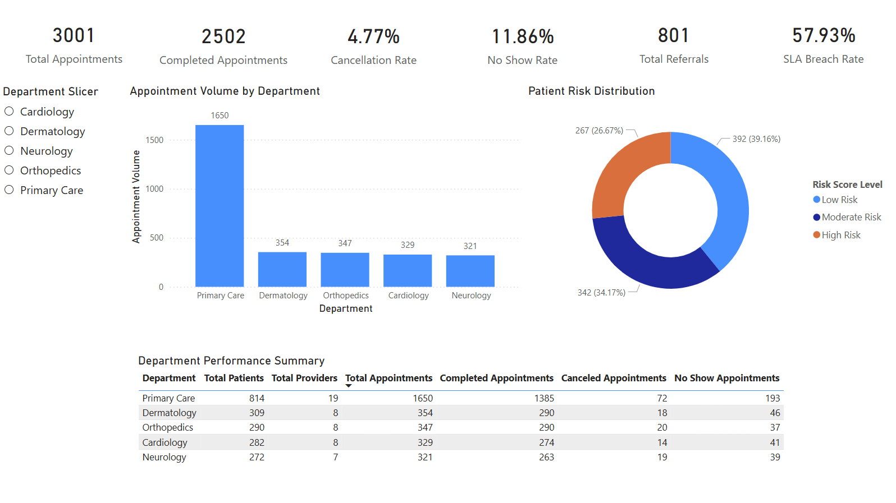
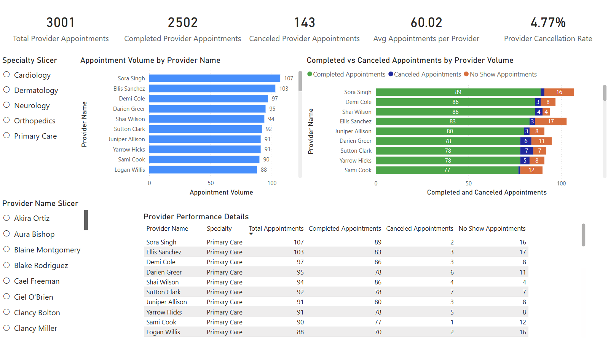
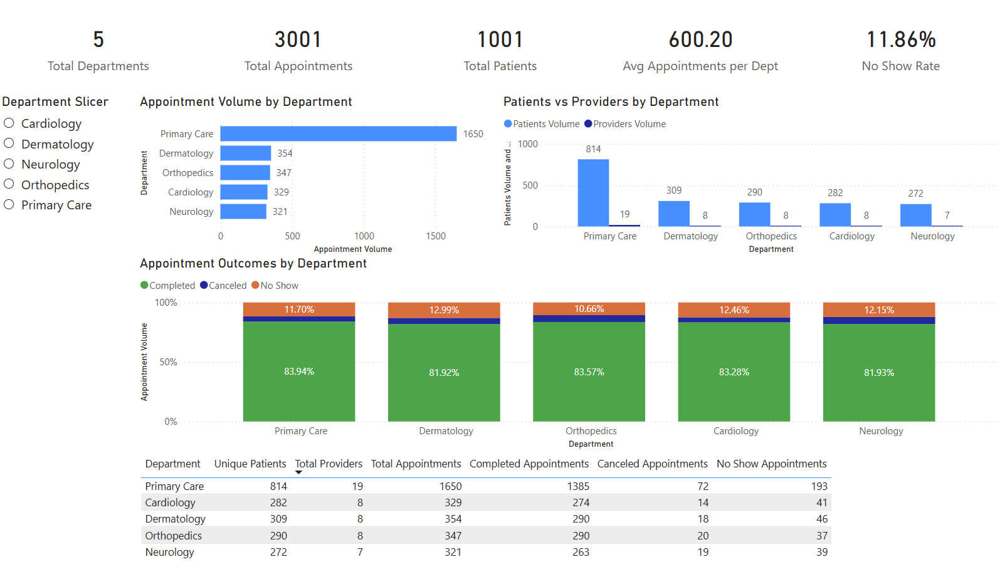
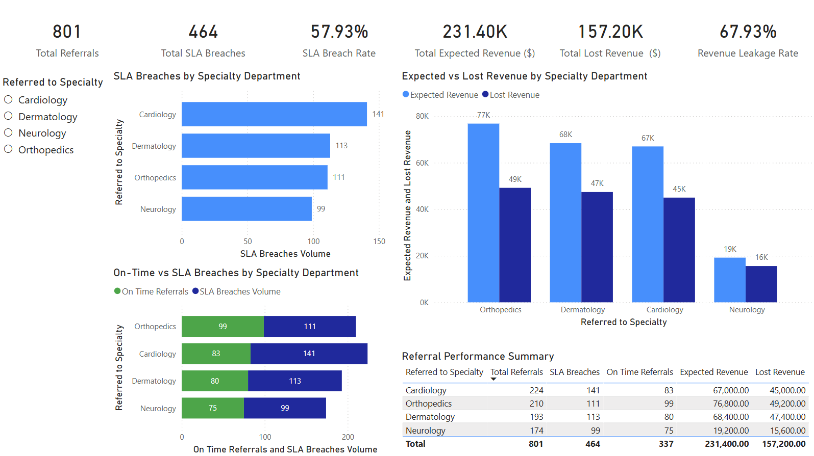
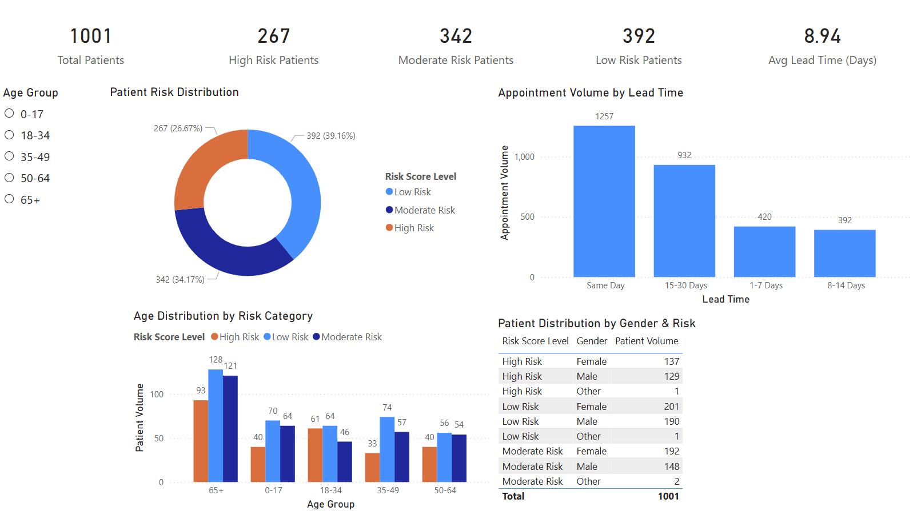
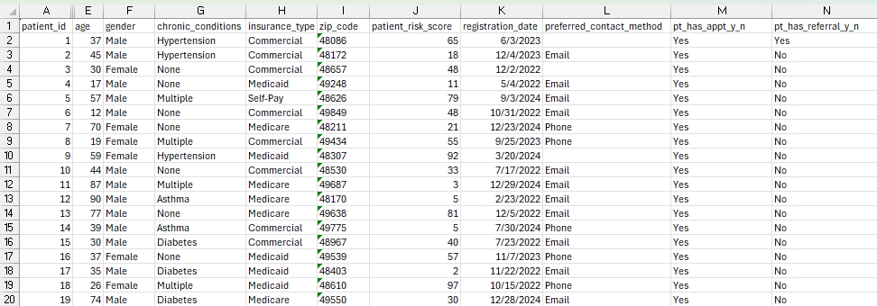
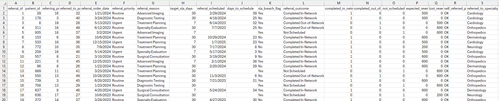

# Clinical Operations Dashboard

## Table of Contents

- [Overview](https://github.com/Ari-healthcare-data/Clinical-Operations-Dashboard?tab=readme-ov-file#overview)
  - [Clinical Operations Dashboard](https://github.com/Ari-healthcare-data/Clinical-Operations-Dashboard?tab=readme-ov-file#clinical-operations-dashboard-1)
  - [Dashboard Preview](https://github.com/Ari-healthcare-data/Clinical-Operations-Dashboard?tab=readme-ov-file#dashboard-preview)
  - [Why I Built This](https://github.com/Ari-healthcare-data/Clinical-Operations-Dashboard?tab=readme-ov-file#why-i-built-this)
  - [Dataset Overview](https://github.com/Ari-healthcare-data/Clinical-Operations-Dashboard?tab=readme-ov-file#dataset-overview)
- [Dataset Generation](https://github.com/Ari-healthcare-data/Clinical-Operations-Dashboard/blob/main/documentation/dataset_generation.md#dataset-generation)
- [Dataset Formulas Reference](https://github.com/Ari-healthcare-data/Clinical-Operations-Dashboard/blob/main/documentation/dataset_formulas_reference.md#dataset-formulas-reference)
- [Methodology](https://github.com/Ari-healthcare-data/Clinical-Operations-Dashboard/blob/main/documentation/methodology.md#methodology)
- [Portfolio Notes](https://github.com/Ari-healthcare-data/Clinical-Operations-Dashboard/blob/main/documentation/portfolio_notes.md#portfolio-notes)

## Overview

This project is a healthcare analytics case study I built using a synthetic EMR-style dataset to simulate how clinical operations teams use data to identify gaps in patient access, provider utilization, and referral workflows, and turn those insights into actionable decisions.

I designed this project to mirror the type of work done in clinical operations and healthcare analytics teams, especially in environments that use EMR systems like Epic's MiChart.

This dataset is fully synthetic and created for learning purposes only. It does not contain any real patient data or provider data. Please see [Dataset Generation](documentation/dataset_generation.md) for more details on how the dataset was created.

---

## Clinical Operations Dashboard

### Problem Statement

I built this dashboard to help clinical teams spot bottlenecks and track key operational metrics. It enables clinical managers to track appointment volumes, provider performance, department efficiency, patient risk, and referral workflows.

### Dashboard Context

I designed this dashboard for internal clinical managers. It provides actionable metrics at provider, department, and operational levels to help identify bottlenecks, optimize workflows, and improve patient access.

### Dashboard Overview

The report contains five pages:

1. **Executive Overview:** High-level KPIs and operational summary  
2. **Provider Performance:** Provider-level appointment outcomes and workload  
3. **Department Overview:** Department-level efficiency and patient distribution  
4. **Referral & SLA Analysis:** Specialty referrals, SLA breaches, and revenue impact  
5. **Patient Risk & Access:** Risk segmentation and appointment lead times

### Key Metrics & Definitions

- **Total Appointments:** Count of scheduled appointments  
- **Completed Appointments:** Appointments successfully attended  
- **Canceled Appointments:** Appointments canceled before the scheduled time  
- **No-Show Appointments:** Appointments where patients did not attend  
- **Cancellation Rate:** Canceled / Total Appointments  
- **No-Show Rate:** No-Show / Total Appointments  
- **SLA Breach:** Referrals processed later than the expected time threshold  
- **Revenue Leakage:** Estimated revenue lost due to delayed referrals

### Key Insights

- Primary Care drives most activity (~55% of appointments), which makes sense since it’s the first point of contact for most patients.
- No-show rate (~12%) is noticeable, which is a reminder that patient attendance can affect clinic efficiency.  
- Referral SLA breach rate (~58%) shows bottlenecks in specialty access.  
- Cardiology and Dermatology have higher SLA delays and revenue leakage than other departments.  
- Same-day appointments represent a significant portion of total scheduling, possibly reflecting urgent care or open-access scheduling models.

## Challenges & Lessons Learned

Working with this synthetic EMR dataset came with a few challenges. Initially, patient counts were double-counted across departments, which taught me the importance of using DISTINCTCOUNT and validating results at every step.

Defining mutually exclusive appointment outcomes (Completed, Canceled, No-Show) in SQL required careful CASE logic to avoid overlap. Testing these calculations across multiple dashboard pages ensured all KPIs aligned correctly.

I also noticed some referral and scheduling patterns were unrealistic at first. Adjusting the synthetic dataset to better reflect real-world healthcare workflows helped me understand how operational bottlenecks, like referral delays or high no-show rates, impact performance metrics.

## Dashboard Preview

Below are screenshots of the five Power BI Dashboard pages:
- Executive Overview  
- Provider Performance  
- Department Overview  
- Referral & SLA Analysis  
- Patient Risk & Access

### Executive Overview

This page provides a concise, high-level snapshot of clinic operations—covering total appointments, completion rates, cancellations, no-shows, referral volumes, and SLA breach rates. It helps stakeholders quickly understand overall performance and key metrics by department and patient risk category.



<br>

### Provider Performance

This page focuses on individual providers, detailing appointment volumes, cancellation and no-show rates, and workload distribution. Interactive slicers allow readers to filter by provider or specialty, making it easy to identify performance trends and opportunities for improvement.



<br>

### Department Overview

Here, appointment volumes and patient-provider distributions are broken down across clinical departments. It highlights appointment outcomes and department-level summaries to support identifying operational bottlenecks and optimizing resource allocation.



<br>

### Referral & SLA Analysis

Dedicated to specialty referrals, this page tracks referral volumes, SLA breaches, and their revenue impact by department. It enables stakeholders to monitor access efficiency, pinpoint bottlenecks, and assess financial risks related to delays.



<br>

### Patient Risk & Access

This page segments the patient population by risk level and age group, visualizing appointment lead times and demographic patterns. It supports efforts to understand patient access trends and prioritize care based on clinical risk.



---

## Why I Built This

I’m transitioning into a healthcare data and analyst focused role, and I wanted a project that gives me hands-on experience simulating realistic clinical workflows, not just isolated static datasets.

Instead of using a simple dataset, I built a multi-table system (patients, providers, appointments, referrals, etc.) to better understand:

- How clinical data is structured
- How different parts of the system connect
- How operational issues (like no-shows or referral leakage) show up in the data

By analyzing referral bottlenecks, I could see how small delays snowball into bigger operational problems, which is something I found fascinating.

---

## Project Focus

The main question behind this project is:

> How can clinic operations be improved using EMR data?

Some of the areas I plan to analyze:

- No-show rates and scheduling patterns
- Provider utilization and workload
- Referral completion and leakage
- Operational bottlenecks in access to care

---

## Business Value

This project is designed to support common clinical operations decisions, such as:

- Identifying departments with high no-show rates
- Understanding provider capacity and utilization gaps
- Reducing referral leakage and improving care coordination
- Highlighting scheduling inefficiencies impacting patient access

---

## Dataset Overview

Tables included:

- Patients (demographics, risk, insurance)
- Providers (specialty, capacity, availability)
- Departments (clinic structure)
- Appointments (core operational data)
- Referrals (care transitions + revenue impact)
- Calendar (time-based analysis)
- Financial Assumptions (cost + revenue modeling)

The dataset includes:

- ~1,000 patients
- ~3,000 appointments
- ~800 referrals

## Dataset Samples

Below is an example of the Patients table used in this project:



This table contains simulated demographic and insurance information used for patient segmentation and analysis.

### Appointments Table


The appointments table serves as the central fact table, capturing patient encounters, provider assignments, and visit outcomes such as completed visits and no-shows.

### Referrals Table



The referrals table connects completed appointments to specialty care providers, enabling analysis of referral flow and care transitions.

---

## Data Quality Note

This dataset intentionally includes a few common real-world data challenges, such as:
- Missing values (e.g., patient contact preferences)
- Inconsistent formatting (e.g., provider availability fields)
- Duplicate records (e.g., holiday entries)

These were not treated as mistakes, but as part of the design. In real healthcare data environments, datasets are rarely perfect, and handling these issues is a key part of the analysis process.

They will be cleaned and standardized in later phases using SQL.

---

## Tools Used

- Excel for data generation
- PostgreSQL (pgAdmin) for data cleaning and transformation
- Power BI for dashboard development
- GitHub for version control and documentation

---

## Project Structure 

Here’s the project folder structure on my local machine:

```
Clinical-Operations-Dashboard/
  - data/
  - sql/
  - powerbi/
  - documentation/
  - images/
  - README.md
```

---

## Data Transformation Layers

To make the dataset easy to analyze and ensure metrics were accurate, I used a multi-layer data architecture. Each layer serves a clear purpose and makes debugging and KPI validation easier.

### 1. Raw Layer
- Original dataset stored in Excel format
- Exported into CSV files for database ingestion

### 2. Database Layer
- Data loaded into PostgreSQL using pgAdmin 4
- Tables represent structured relational entities

### 3. Clean Layer (data_cleaning.sql)
- Created standardized views for analysis
- Handled missing values using COALESCE
- Converted categorical flags (Yes/No) into boolean fields
- Spot checks applied to ensure correctness

I personally prefer separating cleaning from analytics because it makes it easier to troubleshoot complex metrics. This lets me to validate each metric step-by-step before using them in Power BI, which reduced errors and made the workflow more maintainable.

### 4. Analytics Layer (analytics_views.sql)
- Built aggregated views for reporting and dashboards
- Metrics include:
  - Provider workload
  - Department-level summaries
  - Referral SLA performance
  - Appointment lead time
  - Patient risk segmentation

---

## KPI Development

Analytical views were designed to support key healthcare KPIs:

- Appointment completion rate
- No-show rate
- Cancellation rate
- Provider workload distribution
- Referral SLA breach rate
- Department utilization metrics
- Patient risk segmentation
- Appointment lead time

I designed these KPIs so the dashboards could give a clear picture of clinic performance.

---

## Notes

All data used in this project is synthetic and created for learning and portfolio purposes only. No real PHI, patient data or provider data. Please see [Dataset Generation](documentation/dataset_generation.md) for more details on how the dataset was created.
